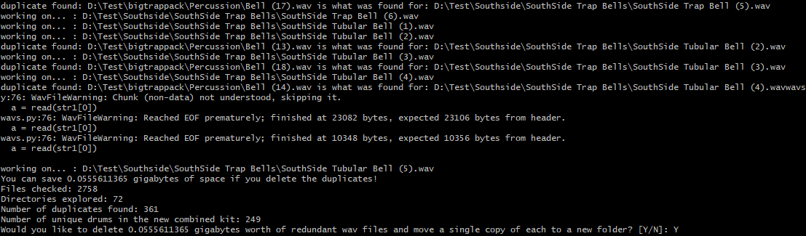

# DrumPy

DrumPy is a python script made to remove the redundancy caused by "different" drumkits that inlcude the same sounds which are then downloaded by music producers.

## Requirements

Python 2.6 - 3.8
Windows 10

## Installation

Click "Clone" and "Download ZIP", Extract zip somewhere and move python script into the root of your drums folders.

## Usage
Run a shell with admin privileges and type
```shell
python drumpy.py
```


You will see a recap of what was found, enter 'Y' to confirm.
You will now have a new directory in your drumkit named "duplicate drums" that is made of the duplicates that were found. You can reorganize the non-hidden files into the correct folder if they were assigned into an incorrect folder.
